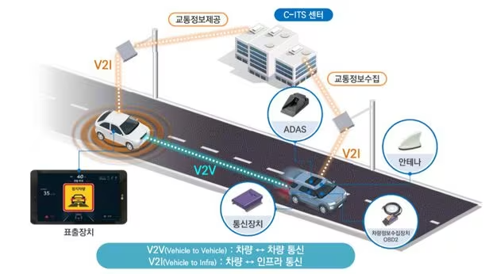
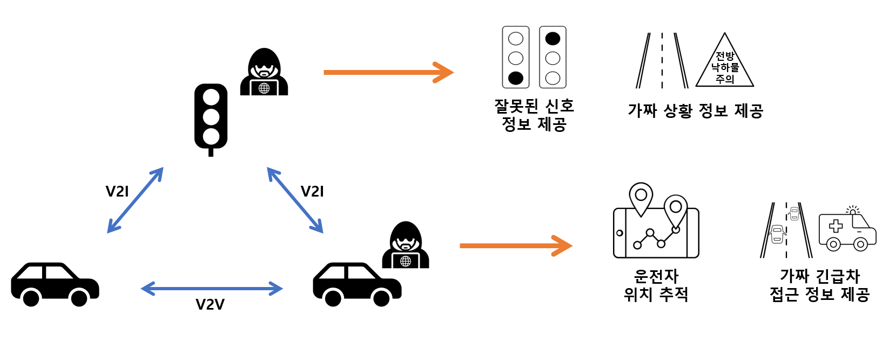
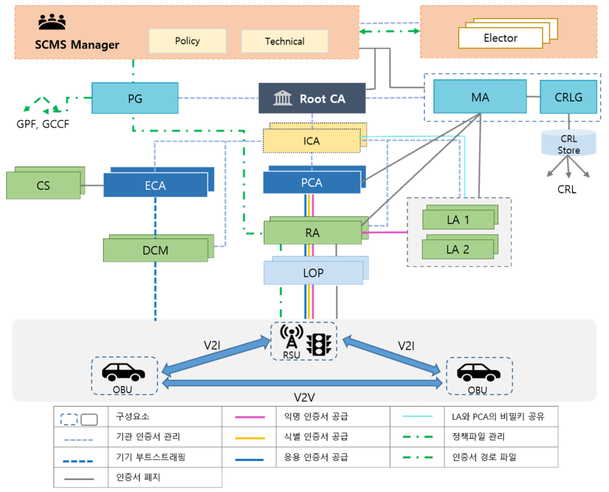
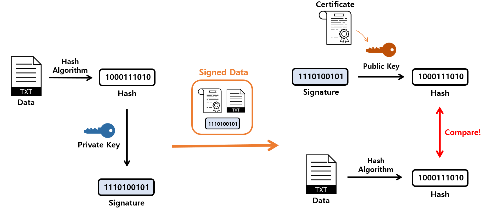
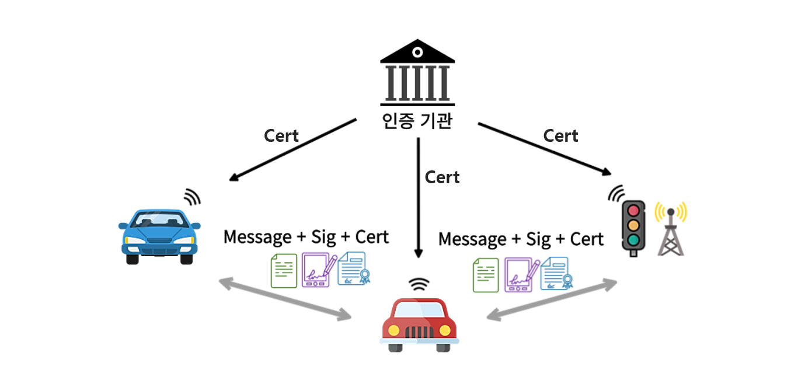
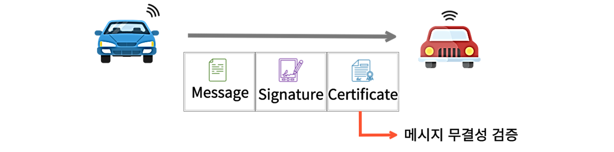

# __C-ITS with V2X SCMS__

---
- C-ITS
  - What is C-ITS?
  - Threats in the V2X communication environment


- V2X SCMS
  - What is SCMS?
  - Types and functions of certificates
  - The role of agency


- Certificate-based communication
  - Signing and verification
  - Communication process
---
<br><br><br>

## __C-ITS (Cooperative Intelligent Transport Systems)__

---
### 1. What is C-ITS?
<br>
- Vehicles and road infrastructure exchange traffic information in real time through two-way communication.
- Improved road safety and mobility
- Providing safety services through ‘V2X communication’
  - Provides location-based traffic information
  - Emergency vehicle approach warning
  - Providing road danger section information
```
V2X(Vehicle to Everything) Communication: vehicle <-> vehicle, infrastructure, pedestrian
```

<br>

### 2. Threats in the V2X communication environment
<br>
- Information sharing between various devices participating in communication
- Possible `security threat` is as follows.<br>
  ex) Hacking, Information leakage, etc.

- Requirement for reliability of information and anonymity of users<br>
<b>=> Requires a safe and secure communication environment!</b>
<br><br><br><br>

## __V2X SCMS (V2X Security Credential Management System)__

---
### 1. What is SCMS?
- Public key-based authentication system
- Provides management functions for certificates of vehicles and infrastructure

<br>

### 2. Types and functions of certificates
- Enrollment Certificate
  - For `Credentials` Certificate
  - Used when requesting Pseudonym/Identification/Application Certificates
  - ex) Vehicles, Infrastructure


- Pseudonym Certificate
  - `privacy protection` of vehicles
  - ex) Normal vehicles except public vehicles


- Identification Certificate
  - `Identity` of vehicles that do not require privacy
  - ex) Ambulance, Police Car, Fire Truck, etc.


- Application Certificate
  - collect and provide of `traffic information`
  - ex) Road Infrastructure

<br>

### 3. The role of agency
<br>
- ECA (Enrollment CA)
  - Issuance and management of certificates for V2X communication devices
  - `Ex) Enrollment Certificate`


- PCA (Pseudonym CA)
  - Issuance and management of certificates required for secure communication of devices
  - Certificate issuance is performed at the request of the RA.
  - `Ex) Pseudonym Certificate, Identification Certificate, Application Certificate`
  

- RA (Registration Authority)
  - Acts as a relay so that the device can `access the authentication system`
  - Provide services for issuing certificates for devices linked to PCA
  - Support MA's certificate revocation work
  - Ex) Pseudonym Certificate, Identification Certificate, Application Certificate

  
- LOP (Location Obscurer Proxy)
  - In response to a request for issuance of an pseudonym certificate, information that could be used for `vehicle location information is removed and forwarded to the RA`


- MA (Misbehavior Authority)
  - `Abnormal behavior verification agency`
  - Determination of abnormal behavior based on abnormal behavior report transmitted from V2X communication device
  - Revocation of certificates for anomalous devices
<br><br><br><br>

## __Certificate-based communication__

---
### 1. Signing and Verification
<br>
- Store own public and private key pairs
  - The public key is stored in own certificate.


- `Sender`
  - Data' = Hash(Date)
  - Generate a signature for Data’ using sender's private key
  - Send the Data, Signature, Certificate


- `Recipient`
  - Data'' = Hash(Data)
  - Obtain Data’ from the Signature using the sender’s public key in received Certificate
  - Check Data' == Data''

<h3>
<span style="color:#0091EA"><br>⇒ User Authentication, Message Integrity Verification</span>
</h3>

```
user authentication: verify that the message comes from the person I am communicating with
```
```
message integrity: ensure that the message has not been forged or altered in the middle.
```

<br>

### 2. Communication Process
<br>
- Issuance of a `appropriate certificate for the situation` from a certification authority through a enrollment certificate
  - Generate a signature for the message then `perform communication with certificate`

<br>

<br>
- Extract the sender's public key from the `Certificate`
- Verify the `Signature` for the `Message` with the corresponding public key

<br>
<h3>
    <span style="color:#0091EA">
        <strong>&nbsp&nbsp⇒ Provides a secure communication environment</strong>
    </span>
</h3>

---