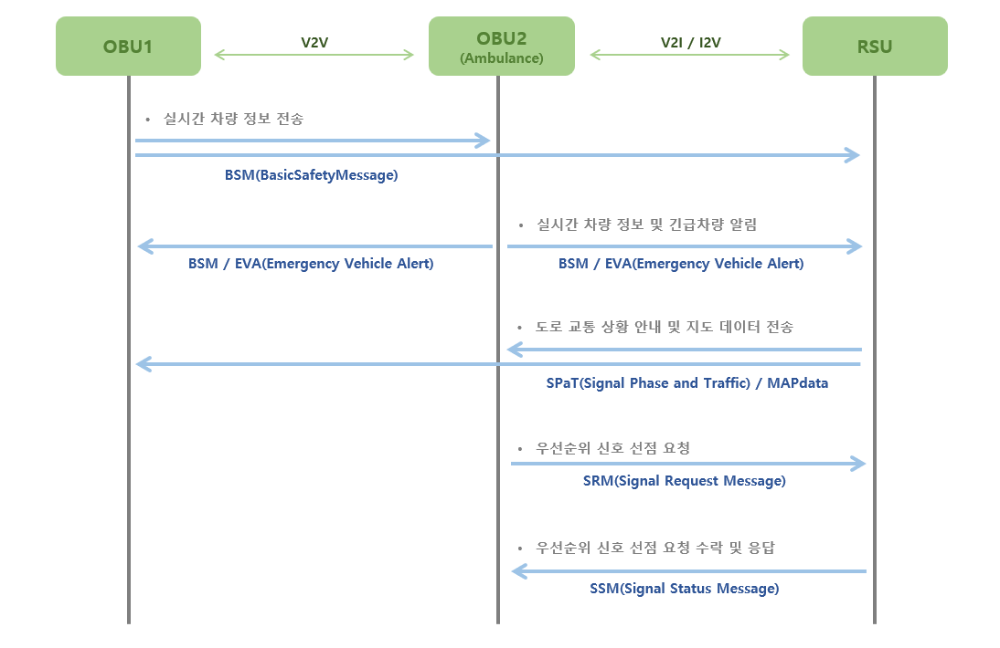
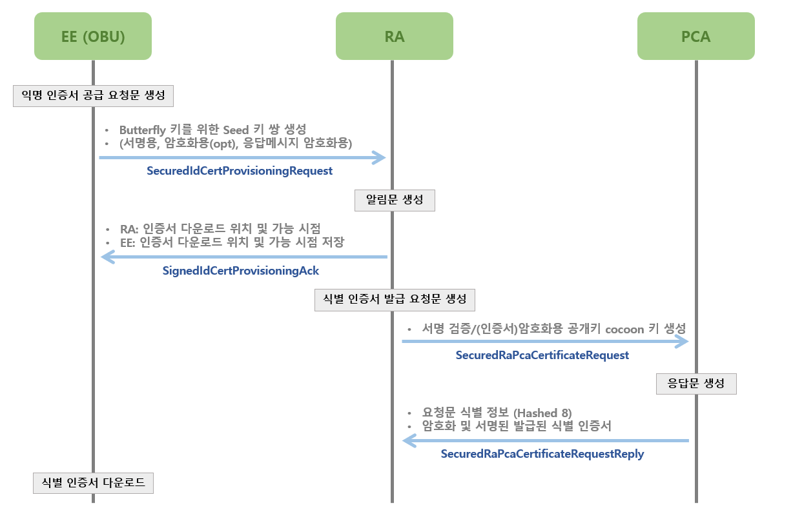

# __Message Process__

---
- Core Source
  - ieee1609dot3_parsing.py
  - j2735_message_parsing.py
  - scms_message_parsing.py

- Message Communication
  - j2735 message
  - scms message
---
   

## __Core Source__

---
### __ieee1609dot3_parsing.py__
- Generate WSM(WAVE Short Message) for WAVE(Wireless Access in Vehicular Environments) communication 
- Perform encoding, decoding and dissecting about `Ieee1609Dot3Data`
  

### __j2735_message_parsing.py__
- Generate SAE J2735 messages for V2X(Vehicle-to-Everything) communication
- Perform encoding, decoding and dissecting about `Safety Messages`
  

### __scms_message_parsing.py__
- Generate SCMS messages for SCMS(Security Credential Management System) communication
- Perform encoding, decoding and dissecting about `Ieee1609Dot2Data-based SCMS PDU`

   
## __Message Communication__

---
### __J2735 Message__
 
- Messages transmitted between OBU (On-board Unit) and RSU (Roadside Unit) for WAVE-based V2X communication
- Perform `DSA signing` on all transmitted Safety Messages (J2735 messages) 
- <b>List of J2735 Messages that can be generated through the corresponding source code</b>
  > BSM (Basic Safety Message)  
  > SPaT (Signal Phase and Traffic)  
  > RSA (Road Side Alert)  
  > EVA (Emergency Vehicle Alert)  
  > SRM (Signal Request Message)  
  > SSM (Signal Status Message)  
  > MAPdata

   

### __SCMS Message__
 
- Messages transmitted between OBU and RA/PCA requesting SCMS certificate for secure communication in V2X environment
- Perform `DSA signing` and `optional AES encryption` on transmitted messages 
- Perform `ECIES encryption` for secure key exchange during `Butterfly Key Expansion`
- <b>List of SCMS Messages that can be generated through the corresponding source code</b>
  > SecuredIdCertProvisioningRequest  
  > SignedIdCertProvisioningAck  
  > SecuredRaPcaCertificateRequest  
  > SecuredRaPcaCertificateRequestReply

   
